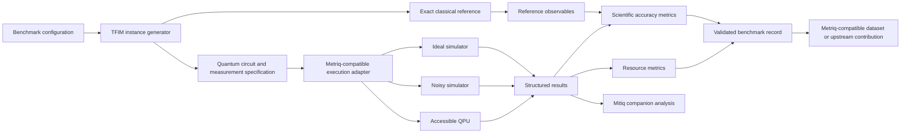

# AfriQBench Technical Architecture

## Design principles

### 1. Separate benchmark definition from execution

The scientific workload should be specified independently from the provider used to execute it.

### 2. Keep classical references transparent

Small TFIM instances are validated with exact diagonalization so benchmark accuracy is interpretable.

### 3. Separate canonical benchmarking from mitigation

Error mitigation can be studied in companion analyses without changing the definition of the baseline benchmark.

### 4. Prefer upstream compatibility

Metriq-specific execution and result interfaces should follow the current upstream `metriq-gym` conventions wherever practical.

### 5. Report both scientific and computational performance

Application-level error alone is not sufficient. AfriQBench also records circuit and execution resources.
